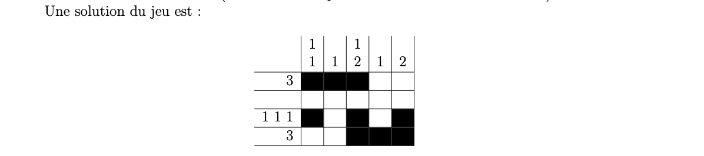

# Un problème de Tomographie discrète
Considérons une grille de $N$ lignes numérotées de $0$ à $N-1$ et $M$ colonnes numérotées de $0$ à $M-1$. 

Chacune des $N\times M$ cases doit être colorée en blanc ou en noir. À chaque ligne $l_i,\, i=0...N-1$, est associée une séquence d'entiers représentant les longueurs des blocs de cases noires de la ligne. 

De même, à chaque colonne $c_j,\,j=0...M-1$, est associée une séquence d'entiers représentant les longueurs des blocs de cases noires de la colonne.

**Note** : 
- Le $3$ de la ligne $l_0$ signifie que celle-ci contient 1 **bloc de trois cases noires consécutives**
- La séquence $1\,2$ de la colonne $c_2$ signifie qu'elle contient 2 blocs : 
  - le premier d'1 case noire
  - le deuxième de 2 cases noires
  > Les blocs sont séparés d'au moins 1 case blanche

>**OBJECTIF** : Construire une solution *(un coloriage noir-blancs des cases)* répondant aux contraintes

Plus générallement, chaque ligne/colonne se voit assigner une séquence *(potentiellement vide)* $(s_1,s_2...s_k)$ de nombres entiers strictement positifs.

Le coloriage doit comporter sur cette ligne/colonne un premier bloc de $s_1$ cases noires consécutifs, puis un deuxième de $s_2$ cases noires...

>Il n'y a pas d'autres cases noires dans la ligne/colonne.

Les blocs doivent être séparés d'au moins une case blanche. 

Il peut y avoir des cases blanches avant le premier bloc, et/ou après le dernier. 