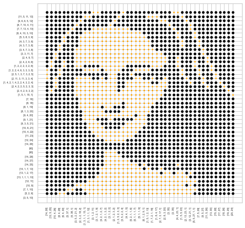

# Un problème de Tomographie Discrète
### Information du binôme
Étudiante 1 : Hoang Thuy Duong VU | 21110221

Étudiante 2 : Halimatou DIALLO | 21114613

### Préliminaire 
Ce projet est réalisé dans le cadre de l'UE Algorithmique II - 3IN003, proposé par Sorbonne Université, Licence Informatique, qui contribue à $15%$ de la note finale. 

Lors de la réalisation du projet, nous souhaitons exprimer nos sincères remerciements à M. Manuel AMOUSSOU, notre professeur en TD, pour nous avoir fourni suffisamment de connaissances concernant de différents méthodes algorithmiques, la programmation dynamiques, etc. afin d'optimiser au maximum la complexité des programmes; à notre ami Alexis VU pour nous avoir aider à mieux comprendre le moteur du jeu; et à aux responsables de l'UE Algorithmique II. 

#### À noter que les codes du projet sont construits manuellement, sans l'aide de ChatGPT.

### Règle du jeu
Considérons une grille de $N$ lignes numérotées de $0$ à $N-1$ et $M$ colonnes numérotées de $0$ à $M-1$. Chacune des $N\times M$ cases doit être coloriée en blanche ou en noire. 

À chaque ligne $l_i, \, 0,\,...N-1$, est associée une séquence d'entiers représentant les longueurs des blocs de cases noires de la ligne. De même, à chaque colonne $c_j, \, j=0,\,...M-1$, est associée une séquence d'entiers représentant les longueurs des blocs de cases noires de la colonne. 

